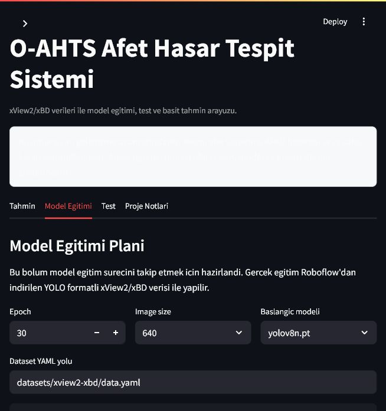

# O-AHTS - Basit Afet Hasar Tespit Projesi

Bu proje, xView2/xBD afet hasar verileri ile model egitimi, test ve tahmin akisini gostermek icin hazirlanan basit bir ogrenci projesidir.

> Durum: Proje gelistirme asamasindadir. Resmi afet yonetimi, AFAD bildirimi veya saha karari icin kullanilmaz.

## Ekran Goruntuleri

### Tahmin Ekrani


### Model Egitimi Ekrani



### Test Ekrani


## Projenin Amaci

SRS dokumaninda anlatilan Otonom Afet Hasar Tespit Sistemi fikri burada cok daha basit bir seviyeye indirildi.

Bu repoda hedeflenen akış:

1. xView2/xBD verileriyle model egitmek.
2. Egitilen modeli test gorselleriyle denemek.
3. Model sonucunu basit bir Streamlit arayuzunde gostermek.

## SRS Dokumani

Projenin genel fikri ve daha buyuk kapsamli hedefleri icin SRS dokumani:

[O-AHTS SRS Dokumani](docs/O-AHTS-SRS.pdf)

## Su An Ne Var?

- Streamlit tabanli basit frontend.
- Roboflow hosted model baglantisi.
- Hazir test gorselleri.
- Tek gorsel uzerinde hasar tahmini.
- Sinif bazli sayaclar.
- YOLO egitimi icin basit script.
- Roboflow model testi icin basit script.

## Siniflar

Model xView2/xBD hasar siniflariyla calisir:

- `destroyed`
- `major-damage`
- `minor-damage`
- `no-damage`

## Kurulum

```bash
python -m venv .venv
.venv\Scripts\activate
pip install -r requirements.txt
```

Egitim yapmak istenirse ek paketler:

```bash
pip install -r requirements-train.txt
```

## Calistirma

```bash
streamlit run app.py
```

Uygulama acildiktan sonra:

1. **Tahmin** sekmesinden hazir test gorseli secilebilir.
2. **Model Egitimi** sekmesinden egitim komutu hazirlanabilir.
3. **Test** sekmesinden model test edilebilir.

## Roboflow Ayari

`.env.example` dosyasini `.env` olarak kopyalayin:

```env
ROBOFLOW_API_KEY=your_api_key_here
ROBOFLOW_MODEL_ID=xview2-xbd/2
ROBOFLOW_WORKSPACE=flow-wnra9
ROBOFLOW_WORKFLOW_ID=
```

API key gizli kalmalidir. `.env` dosyasi GitHub'a yuklenmez.

Roboflow Universe proje linki:

https://universe.roboflow.com/flow-wnra9/xview2-xbd

## Model Egitimi

Roboflow'dan YOLO formatinda veri indirildikten sonra klasor yapisi ornek olarak soyle olabilir:

```text
datasets/
  xview2-xbd/
    data.yaml
    train/
    valid/
    test/
```

Egitim komutu:

```bash
python scripts/train_yolo.py --data datasets/xview2-xbd/data.yaml --model yolov8n.pt --epochs 30 --imgsz 640
```

Egitim sonunda en iyi agirlik dosyasi genelde burada olusur:

```text
runs/detect/oahts_train/weights/best.pt
```

## Test

Roboflow hosted model ile test:

```bash
python scripts/test_model.py --image sample_data/sample_mixed_damage.png --model-id xview2-xbd/2
```

Sonuc `test_result.json` dosyasina yazilir.

## Kapsam Disi Birakilanlar

Bu asamada su ozellikler yoktur:

- AFAD veya Kandilli entegrasyonu.
- Otomatik deprem tetikleme.
- Uydu verisini otomatik indirme.
- Harita/GeoJSON uretimi.
- Saha ekibi mobil modulu.
- Resmi bildirim sistemi.

Bu ozellikler projenin sonraki gelistirme asamalarinda dusunulebilir.

## Not

Bu repo bilerek sade tutuldu. Amac once veri, egitim, test ve tahmin akisini calisir hale getirmek; daha sonra harita ve operasyonel modulleri eklemektir.
