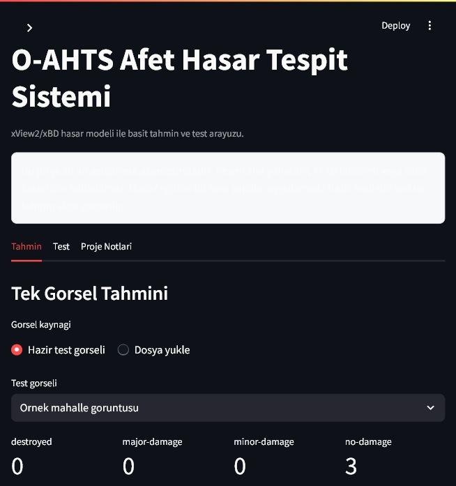
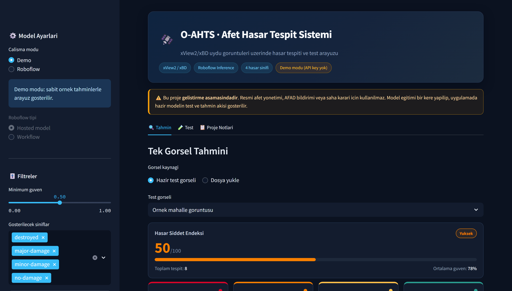
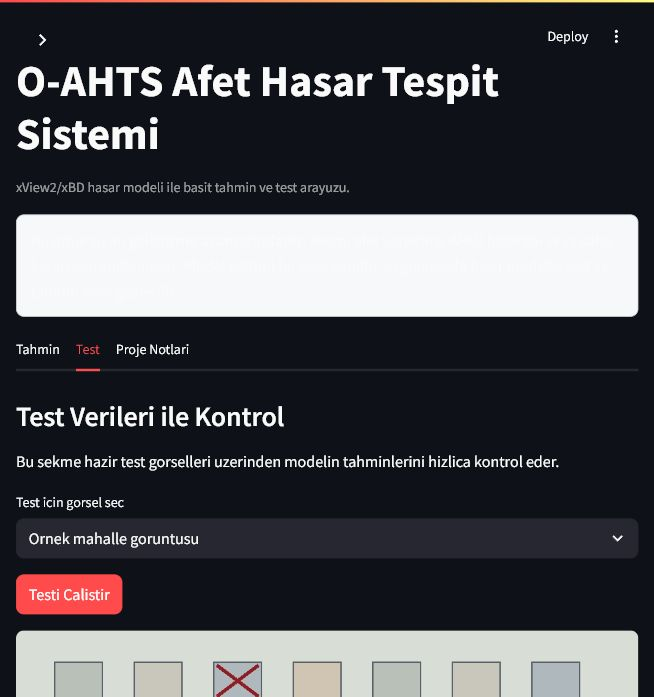

# O-AHTS - Basit Afet Hasar Tespit Projesi

Bu proje, xView2/xBD afet hasar verileriyle hazirlanan modeli kullanip test etmek icin yapilan basit bir projedir. Yapım asamasindadir.

> Durum: Proje gelistirme asamasindadir. Resmi afet yonetimi, AFAD bildirimi veya saha karari icin kullanilmaz.

## Ekran Goruntuleri

### Tahmin Ekrani



### Analiz Paneli



### Test Ekrani



## Projenin Amaci

SRS dokumaninda anlatilan Otonom Afet Hasar Tespit Sistemi fikri burada cok daha basit bir seviyeye indirildi.

Bu repoda hedeflenen akis:

1. xView2/xBD verileriyle model bir kere egitilir.
2. Egitilen veya Roboflow uzerinde hazir duran model uygulamaya baglanir.
3. Hazir test gorselleri veya yuklenen gorseller ile model sonucu gosterilir.

## SRS Dokumani

Projenin genel fikri ve daha buyuk kapsamli hedefleri icin SRS dokumani:

[O-AHTS SRS Dokumani](docs/O-AHTS-SRS.pdf)

## Su An Ne Var?

- Streamlit tabanli modern (dark tema) frontend.
- Roboflow hosted model / workflow baglantisi.
- Hazir test gorselleri.
- Tek gorsel uzerinde hasar tahmini.
- Sinif bazli renkli metrik kartlari ve orantili dagilim barlari.
- 0-100 arasi hasar siddet endeksi (Kritik / Yuksek / Dusuk).
- Guven esigi ve sinif filtreleri.
- Sonuclari PNG / CSV / JSON olarak disa aktarma.
- Roboflow model testi icin basit script.
- Bir kere kullanilacak YOLO egitim scripti.

## Siniflar

Model xView2/xBD hasar siniflariyla calisir:

- `destroyed`
- `major-damage`
- `minor-damage`
- `no-damage`

## Kurulum

```bash
python -m venv .venv
.venv\Scripts\activate
pip install -r requirements.txt
```

## Calistirma

```bash
streamlit run app.py
```

Uygulama acildiktan sonra:

1. **Tahmin** sekmesinden hazir test gorseli secilebilir veya dosya yuklenebilir.
2. **Test** sekmesinden hazir test gorselleri ile model kontrol edilebilir.
3. **Proje Notlari** sekmesinden projenin kapsami gorulebilir.

## Roboflow Ayari

`.env.example` dosyasini `.env` olarak kopyalayin:

```env
ROBOFLOW_API_KEY=your_api_key_here
ROBOFLOW_MODEL_ID=xview2-xbd/2
ROBOFLOW_WORKSPACE=flow-wnra9
ROBOFLOW_WORKFLOW_ID=
```

API key gizli kalmalidir. `.env` dosyasi GitHub'a yuklenmez.

Roboflow Universe proje linki:

https://universe.roboflow.com/flow-wnra9/xview2-xbd

## Model Egitimi

Model egitimi uygulamanin ana ekrani degildir. Bu islem sadece bir kere yapilip elde edilen model daha sonra uygulamada kullanilir.

Roboflow'dan YOLO formatinda veri indirildikten sonra klasor yapisi ornek olarak soyle olabilir:

```text
datasets/
  xview2-xbd/
    data.yaml
    train/
    valid/
    test/
```

Gerekirse egitim paketleri kurulur:

```bash
pip install -r requirements-train.txt
```

Egitim komutu:

```bash
python scripts/train_yolo.py --data datasets/xview2-xbd/data.yaml --model yolov8n.pt --epochs 30 --imgsz 640
```

Egitim sonunda en iyi agirlik dosyasi genelde burada olusur:

```text
runs/detect/oahts_train/weights/best.pt
```

## Test

Roboflow hosted model ile test:

```bash
python scripts/test_model.py --image sample_data/sample_mixed_damage.png --model-id xview2-xbd/2
```

Sonuc `test_result.json` dosyasina yazilir.

## Kapsam Disi Birakilanlar

Bu asamada su ozellikler yoktur:

- AFAD veya Kandilli entegrasyonu.
- Otomatik deprem tetikleme.
- Uydu verisini otomatik indirme.
- Harita/GeoJSON uretimi.
- Saha ekibi mobil modulu.
- Resmi bildirim sistemi.

Bu ozellikler projenin sonraki gelistirme asamalarinda dusunulebilir.

## Not

Bu repo bilerek sade tutuldu. Amac hazir/egitilmis modeli kullanarak test ve tahmin akisini gostermektir.
